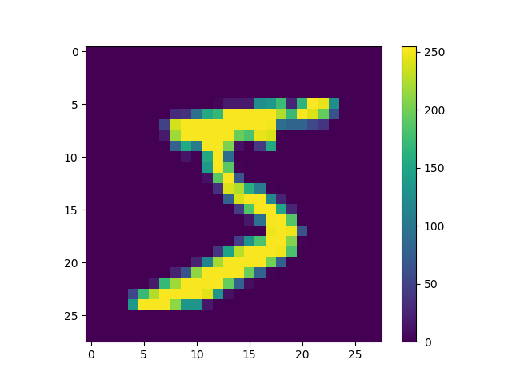
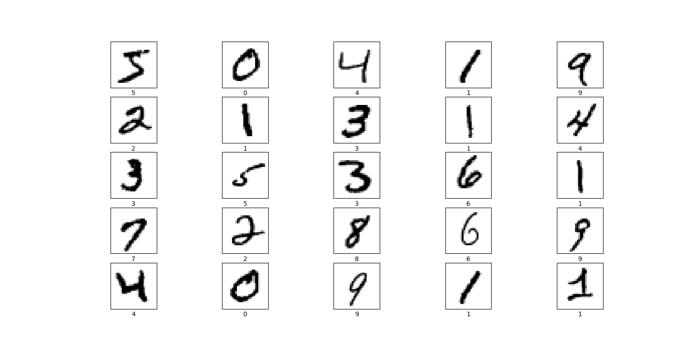
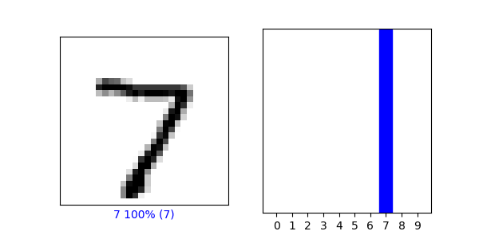
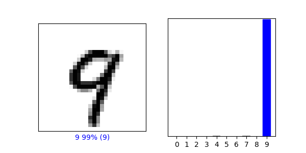
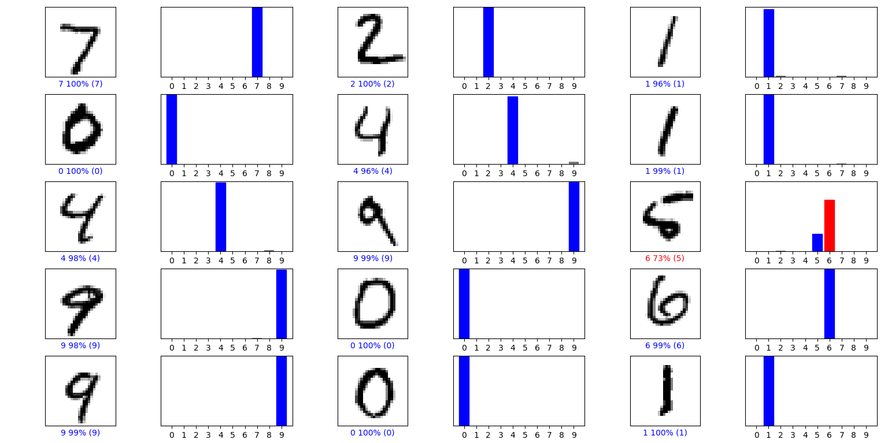

# nn-cnn-mnist-sample
This is a sample test code for mnist data set

### Sample images of DataSet  

  

  

### Train DataSet

  

### Result after training for number Seven

  

### Result after training for number Nine

  

### Result for all the test images

  

